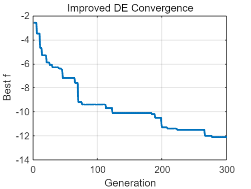

```matlab
clear; clc; close all;
lb_phy = [70 0 70 0 70 0 70 0 70 0 0 1 1 0 0 0 0 1 1 0 0 0 0 1 1 0 0 0 0 1 1 0 0 0 0 1 1 0 0 0];
ub_phy = [140 2*pi 140 2*pi 140 2*pi 140 2*pi 140 2*pi 40 40 40 40 40 40 40 40 40 40 40 40 40 40 40 40 40 40 40 40 40 40 40 40 40 40 40 40 40 40];

objFun = @cal_shelf_norm;      % 目标函数句柄
nVar   = 40;                   % 维度
lb     = -ones(1,nVar);        % 下界
ub     =  ones(1,nVar);        % 上界

opts = struct(...
    'MaxGen',  300, ...
    'PopSize', 1000, ...
    'F',       0.8, ...
    'CR',      0.9, ...
    'display', true, ...
    'plot',    true);

[xBest, fBest, deHist] = DE(objFun, lb, ub, opts);
```

```matlabTextOutput
Gen    50: best f = 7.20
Gen   100: best f = 9.40
Gen   150: best f = 10.10
Gen   200: best f = 11.30
Gen   250: best f = 11.50
Gen   300: best f = 12.10
```



```matlab
x_phy_best = (xBest + 1)/2 .* (ub_phy - lb_phy) + lb_phy;
fprintf('最优物理量：');
```

```matlabTextOutput
最优物理量：
```

```matlab
disp(x_phy_best);
```

```matlabTextOutput
  列 1 至 11

  124.1085    0.1100   93.6280    4.3999  100.6682    1.4881   97.4016    6.2832  134.6947    3.9623    0.0010

  列 12 至 22

   40.0000    1.0189    0.0497    1.1319    0.0075    8.3398   39.1924   31.2241    6.8989   39.2008   10.3262

  列 23 至 33

   27.1507   24.8560   26.2956    0.7726   39.0531   18.3794    4.6579    2.0758   21.2999   30.8776    2.2876

  列 34 至 40

   19.5930   40.0000   25.3615   15.7393   24.2697   27.5889   24.6821
```

```matlab
[t1, t2, t3] = cal_shelf(x_phy_best);
fprintf('最大遮蔽时长：%.3f, %.3f, %.3f s\n', t1, t2, t3);
```

```matlabTextOutput
最大遮蔽时长：10.600, 0.000, 1.500 s
```

```matlab
fprintf("最大总时长%.2f", (t1+t2+t3));
```

```matlabTextOutput
最大总时长12.10
```

```matlab
function [xBest, fBest, hist] = DE(fun, lb, ub, opts)
% 参数
MaxGen  = opts.MaxGen;
NP      = opts.PopSize;
display = opts.display;
doplot  = opts.plot;
nVar    = numel(lb);
p       = 0.15;          % top 100*p% 作为 pbest 候选
c       = 0.1;           % 自适应学习率
muF     = 0.5;           % F 初始均值
muCR    = 0.5;           % CR 初始均值
A       = zeros(0,nVar); % 外部存档（空二维数组）

% 初始化种群
X  = repmat(lb,NP,1) + rand(NP,nVar) .* repmat(ub-lb,NP,1);
fX = arrayfun(@(i) fun(X(i,:)), 1:NP);
[fBest,idx] = min(fX);
xBest = X(idx,:);
hist  = struct('best',[],'mean',[]);
hist(1).best = fBest;
hist(1).mean = mean(fX);

% 主循环
for gen = 1:MaxGen
    %自适应生成 F 与 CR
    F  = min(exprnd(muF, NP, 1), 1);        % 指数分布
    CR = min(max(normrnd(muCR, 0.1, NP, 1), 0), 1); % 高斯截断
    % 排序得到 pbest 池
    [~, sortIdx] = sort(fX);
    topP         = ceil(p*NP);
    pbestIdx     = sortIdx(1:topP);

    Xnew  = zeros(size(X));
    fXnew = zeros(NP,1);
    S_F   = [];   % 成功 F
    S_CR  = [];   % 成功 CR

    for i = 1:NP
        % 变异
        r = randperm(NP); r(r==i) = [];
        % 从存档随机取一行
        if size(A,1) > 0
            rA  = randi(size(A,1));
            x_r = A(rA,:);
        else
            x_r = X(r(1),:);
        end
        pbest = X(pbestIdx(randi(topP)),:);
        V     = X(i,:) + F(i)*(pbest - X(i,:)) + F(i)*(X(r(1),:) - x_r);
        V     = max(min(V, ub), lb);      % 边界处理
        % 交叉：二项
        mask = rand(1,nVar) <= CR(i);
        if sum(mask)==0, mask(randi(nVar))=true; end
        U = X(i,:);
        U(mask) = V(mask);

        % 选择
        fU = fun(U);
        if fU <= fX(i)
            Xnew(i,:) = U;
            fXnew(i)  = fU;
            % 更新存档与成功集合
            A(end+1,:) = X(i,:);
            S_F(end+1)  = F(i);
            S_CR(end+1) = CR(i);
        else
            Xnew(i,:) = X(i,:);
            fXnew(i)  = fX(i);
        end
    end
    X = Xnew;
    fX = fXnew;

    % 精英保留
    [fmin,idx] = min(fX);
    if fmin < fBest
        fBest = fmin;
        xBest = X(idx,:);
    else
        X(1,:) = xBest;
        fX(1)  = fBest;
    end
    % 自适应更新
    if ~isempty(S_F)
        muF  = (1-c)*muF  + c*mean(S_F.^2)/mean(S_F);  % Lehmer 平均
        muCR = (1-c)*muCR + c*mean(S_CR);
    end
    % 维护存档大小
    if size(A,1) > NP
        A = A(randperm(size(A,1),NP),:);
    end
    % 记录历史
    hist(gen).best = fBest;
    hist(gen).mean = mean(fX);

    if display && mod(gen,50)==0
        fprintf('Gen %5d: best f = %.2f\n',gen,-fBest);
    end
end

% 收敛曲线
if doplot
    figure;
    plot([hist.best],'LineWidth',1.8);
    xlabel('Generation'); ylabel('Best f');
    title('Improved DE Convergence');
    grid on;
end
end
```
